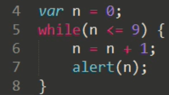

# WEB-development

## Практика студентов Финансового университета

# javaScript
__________________________________________

# Java Script. Оператор ветвления if, циклы do, while, for

### [Методичка](https://docs.google.com/document/d/1Y4N8oo9pN6-yvNcrUwUgOcoTt3sIajDo/edit)

Цель работы

    Получить навыки работы с циклами и научиться создавать проверку условий средствами Java Script.

## Задания для выполнения

Реализовать представленную блок-схему посредством JavaScript

 

Напишите программу на Java Script, которая считает от 1 до 10.

Создайте программу для застолий, которая будет предлагать «Еще по одной?» пока пользователь не введет единицу.

Вычислите факториал числа (вашего порядкового номера в журнале).

Напишите программу, которая проверяет вашу фамилию на палиндром.

Выведите все простые числа от 1 до вашего порядкового номера в журнале. 

Загрузите три полученные программы на GitHub в репозиторий Student, используя формат в названии Фамилия(латинскими буквами)_2.

## Методические указания

Чтобы создать проверку условия, можно воспользоваться оператором if. Синтаксис:

 

Для подсчета чисел от 1 до 10 можно воспользоваться циклом While:

 

Или цикл For:

 

Для реализации программы «Застолье» можно воспользоваться циклом do:

 

## Контрольные вопросы
Какие условия могут проверяться оператором if?

В чем отличие циклов while, do, for?

## Дополнительные задания

Написать программу «Угадай число»: компьютер загадывает произвольное число и если пользователь угадывает его, компьютер сообщает об этом и выходит из цикла. 

# Java Script. Массивы

Цель работы

    Получить навыки работы с массивами и функциями.

## Задания для выполнения

 Сформировать массив из 15 целых чисел, выбранных случайным образом из интервала [-10, 30]. 
 Найти среднее арифметическое положительных элементов.

Заменить отрицательные элементы в числовом массиве из n чисел (n>10) их квадратами, оставив остальные без изменения.

В заданном массиве найти среднее арифметическое положительных чисел, среднее арифметическое отрицательных чисел и число нулей.

Организовать симулятор, который выдает только три случайных значения – красный, черный и белый (0, 1, 2). Запустить симуляцию 1000 000 раз. Узнать, какое максимальное число раз выпадало красное значение.

## Методические указания

Для задания массива достаточно задать: 

    var arr = [];

Для формирования случайного значения можно использовать функцию:

    arr.push(Math.round(Math.random()*2))

Для обращения к элементам массива можно использовать цикл: 

    for(i=0; i<=1000000; i++) {
    arr[i] = Math.round(Math.random()*2);
    }

## Контрольные вопросы

Какие значения могут принимать элементы массива?

## Дополнительные задания
Организовать симулятор, который выдает только три случайных значения – красный, черный и белый (0, 1, 2). 

Запустить симуляцию 1000 000 раз. Узнать, какая последовательность из красных, черных или белых значений была самой длинной.

# Методы объекта, this. Конструкторы, создание объектов через "new"

Цель работы

    Получить навыки работы с объектами JS.

## Задания для выполнения

Скопируйте код объекта и проанализируйте его работу:

    let user = {
    name: "Джон",
    age: 30
    };

Добавим метод для объекта

    user.sayHi = function() {
    alert("Привет!");
    };

    user.sayHi(); // Привет!
 
 
 Создайте объект – информация о покупателе (не менее 5 строк) и выведите три из них.

Создайте объекты пользователи, заказы и рестораны с соответствующими значениями.

Организуйте вывод информации из объектов по условию.

При помощи функции-конструктора и оператора "new" создайте функцию, выводящую имена вашей группы:

    function User(name) {
    this.name = name;
    this.isAdmin = false;
    }

    let user = new User("Вася");

    alert(user.name); // Вася
    alert(user.isAdmin); // false

Используя конструктор, создайте объект – студент. 

Передайте конструктору параметры, определяющие, как создавать объект, и что в него записывать:

    function User(name) {
    this.name = name;

    this.sayHi = function() {
        alert( "Меня зовут: " + this.name );
    };
    }

    let vasya = new User("Вася");

    vasya.sayHi(); // Меня зовут: Вася

    /*
    vasya = {
    name: "Вася",
    sayHi: function() { ... }
    }
    */

## Методические указания

Для задания метода:

    // эти объекты делают одно и то же (одинаковые методы)

    user = {
    sayHi: function() {
        alert("Привет");
    }
    };

    // сокращённая запись выглядит лучше, не так ли?
    user = {
    sayHi() { // то же самое, что и "sayHi: function()"
        alert("Привет");
    }
    };

Для доступа к информации внутри объекта метод может использовать ключевое слово this.

    let user = {
    name: "Джон",
    age: 30,

    sayHi() {
        // this - это "текущий объект"
        alert(this.name);
    }

    };

    user.sayHi(); // Джон

## Контрольные вопросы

Для чего нужен объект?

Какие методы могут быть у объекта?

## Дополнительные задания

Создайте объект Калькулятор, в котором будут реализованы арифметические операции в качестве значений.

## Дополнительные материалы
https://learn.javascript.ru/object-methods

https://learn.javascript.ru/constructor-new
