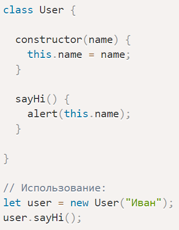

# WEB-development

## Практика студентов Финансового университета

# javaScript
__________________________________________

# Java Script. Классы и функции

### [Методичка](https://docs.google.com/document/d/1mSKPwWwz5djLlKDkeLyjyHs0vNasXjSR/edit)

Цель работы

    Получить навыки работы с классами и функциями.

## Задания для выполнения

Скопируйте код и проанализируйте его работу:

    function showMessage() {
    let message = "Привет, я JavaScript!"; // локальная переменная

    alert( message );
    }

    showMessage(); // Привет, я JavaScript!

    alert( message ); // 
 
 Напишите функцию JavaScript, которая проверяет, является ли переданная строка палиндромом или нет (код из прошлой практической работы)?

Заменить отрицательные элементы в числовом массиве из n чисел (n>10) их квадратами, оставив остальные без изменения (код из прошлой практической работы).

Создайте класс, который будет сохранять в переменную имя пользователя и выводить его на экран. Используйте его.
Перепишите код с использованием синтаксиса класса:

 

Создайте класс, который переворачивает ваше имя.

Загрузить созданные программы на GitHub в репозиторий Student, используя формат в названии Фамилия(латинскими буквами)_4.

## Методические указания

Для задания и вызова класса можно использовать синтаксис:

 

Базовый синтаксис для классов выглядит так:

 

## Контрольные вопросы

Для чего нужен класс?

Как доказать, что класс в JS – это функция?

## Дополнительные задания

Организовать в виде класса и функции симулятор, который выдает только три случайных значения – красный, черный и белый (0, 1, 2). Запустить симуляцию 1000 000 раз. 

Узнать, какая последовательность из красных, черных или белых значений была самой длинной.

## Дополнительные материалы

https://learn.javascript.ru/function-basics

https://learn.javascript.ru/class

https://habr.com/ru/post/518386/

# Java Script. Стрелочные функции

Цель работы

    Получить навыки работы со стрелочными функциями JS.

## Задания для выполнения

Воспользовавшись методическим указанием реализуйте Калькулятор в виде стрелочных функций.

Используя  Function Expression реализуйте проверку условий тестовых заданий.

Реализуйте в виде стрелочной функции функцию, проверяющую вашу фамилию на полиндром.

Реализуйте в виде стрелочной функции вычисление среднего значения данных в массиве

В виде стрелочной функции реализуйте функцию, вычисляющую количество дней до нового года.

Создайте пустую стрелочную функцию возвращает undefined

Создайте массив и напишите стрелочные функции для него: суммирование всех элементов, выявить все четные, умножить каждый элемент на 2. 

Создайте массив с e-mail. Организуйте фильтр на странице html по названию почты.

Загрузить созданные программы на GitHub в репозиторий Student, используя формат в названии Фамилия(латинскими буквами)_4.

## Методические указания

Эти записи равносильны

    let func = (arg1, arg2, ...argN) => expression

    let func = function(arg1, arg2, ...argN) {
    return expression;
    };

Пример  Function Expression

    let age = prompt("Сколько Вам лет?", 18);

    let welcome = (age < 18) ?
    () => alert('Привет') :
    () => alert("Здравствуйте!");

    welcome(); // теперь всё в порядке

Стрелочная функция может быть многослойной

    let sum = (a, b) => {  // фигурная скобка, открывающая тело многострочной функции
    let result = a + b;
    return result; // при фигурных скобках для возврата значения нужно явно вызвать return
    };
    alert( sum(1, 2) ); // 3

Базовый синтаксис

    (param1, param2, …, paramN) => { statements }
    (param1, param2, …, paramN) => expression
    // эквивалентно: (param1, param2, …, paramN) => { return expression; }

// Круглые скобки не обязательны для единственного параметра:

    (singleParam) => { statements }
    singleParam => { statements }

// Функция без параметров нуждается в круглых скобках:

    () => { statements }
    () => expression 
    // Эквивалентно: () => { return expression; }

// Пустая стрелочная функция возвращает undefined

    let empty = () => {};
    (() => 'foobar')(); 

// Удобные операции над массивами: filter, map, ...

    var arr = [5, 6, 13, 0, 1, 18, 23];

    var sum = arr.reduce((a, b) => a + b);  
    // 66

    var even = arr.filter(v => v % 2 == 0); 
    // [6, 0, 18]

    var double = arr.map(v => v * 2);       
    // [10, 12, 26, 0, 2, 36, 46]

## Контрольные вопросы

Есть ли у стрелочной функции метод this?

Может ли стрелочная функция быть без аргументов?

Из-за чего появилась стрелочная функция?

Объяснить работу алгоритма:

    // Стрелочные функции без параметров, которые визуально легче разбирать
    setTimeout( () => {
    console.log('Я буду раньше');
    setTimeout( () => {
        // deeper code
        console.log('Я буду позже');
    }, 1);
    }, 1);

## Дополнительные задания

Организовать симулятор в виде стрелочной функции, который выдает только три случайных значения – красный, черный и белый (0, 1, 2). 
Запустить симуляцию 1000 000 раз. 
Узнать, какая последовательность из красных, черных или белых значений была самой длинной.

## Дополнительные материалы
https://learn.javascript.ru/arrow-functions-basics
